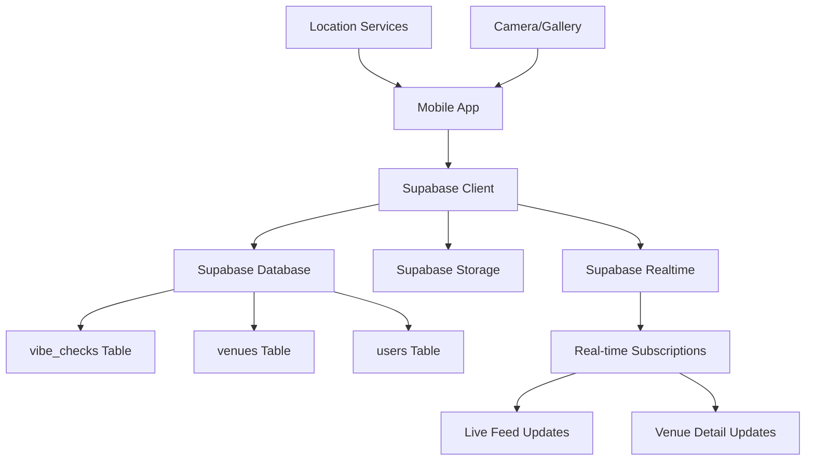

# Live Vibe Check Design Document

## Overview

The Live Vibe Check feature transforms the Buzzvar app from a static venue discovery platform into a dynamic, real-time community-driven experience. Users can share and view current venue conditions through "vibe checks" - quick posts containing busyness ratings, photos, and comments that help others make informed decisions about where to go.

This feature leverages location verification, real-time data synchronization, and intelligent feed algorithms to create an authentic, timely view of the nightlife scene.

## Architecture

### High-Level Architecture



### Data Flow

1. **Posting Flow**: User location → Location verification → Form submission → Database insert → Real-time broadcast
2. **Viewing Flow**: Database query → Location-based filtering → Time-based filtering → UI rendering
3. **Real-time Updates**: Database changes → Supabase Realtime → Client subscriptions → UI updates

## Components and Interfaces

### Database Schema Extensions

#### New Table: vibe_checks

```sql
CREATE TABLE public.vibe_checks (
    id UUID DEFAULT uuid_generate_v4() PRIMARY KEY,
    venue_id UUID REFERENCES public.venues(id) ON DELETE CASCADE NOT NULL,
    user_id UUID REFERENCES public.users(id) ON DELETE CASCADE NOT NULL,
    busyness_rating SMALLINT NOT NULL CHECK (busyness_rating >= 1 AND busyness_rating <= 5),
    comment TEXT CHECK (LENGTH(comment) <= 280),
    photo_url TEXT,
    user_latitude DECIMAL(10, 8) NOT NULL,
    user_longitude DECIMAL(11, 8) NOT NULL,
    created_at TIMESTAMP WITH TIME ZONE DEFAULT NOW() NOT NULL,
    
    -- Constraint: One vibe check per user per venue per hour
    CONSTRAINT unique_user_venue_hour UNIQUE (user_id, venue_id, DATE_TRUNC('hour', created_at))
);

-- Indexes for performance
CREATE INDEX idx_vibe_checks_venue_recent ON public.vibe_checks(venue_id, created_at DESC);
CREATE INDEX idx_vibe_checks_recent ON public.vibe_checks(created_at DESC);
CREATE INDEX idx_vibe_checks_user ON public.vibe_checks(user_id);
```

#### RLS Policies

```sql
-- Enable RLS
ALTER TABLE public.vibe_checks ENABLE ROW LEVEL SECURITY;

-- Anyone can view vibe checks
CREATE POLICY "Anyone can view vibe checks" ON public.vibe_checks FOR SELECT USING (true);

-- Users can insert their own vibe checks
CREATE POLICY "Users can insert own vibe checks" ON public.vibe_checks FOR INSERT 
WITH CHECK (auth.uid() = user_id);

-- Users can update their own vibe checks (within 1 hour)
CREATE POLICY "Users can update own recent vibe checks" ON public.vibe_checks FOR UPDATE 
USING (auth.uid() = user_id AND created_at > NOW() - INTERVAL '1 hour');

-- Users can delete their own vibe checks
CREATE POLICY "Users can delete own vibe checks" ON public.vibe_checks FOR DELETE 
USING (auth.uid() = user_id);
```

### TypeScript Interfaces

```typescript
// Core vibe check interface
export interface VibeCheck {
  id: string;
  venue_id: string;
  user_id: string;
  busyness_rating: 1 | 2 | 3 | 4 | 5;
  comment?: string;
  photo_url?: string;
  user_latitude: number;
  user_longitude: number;
  created_at: string;
}

// Extended interface with user and venue data
export interface VibeCheckWithDetails extends VibeCheck {
  user: {
    id: string;
    name: string;
    avatar_url?: string;
  };
  venue: {
    id: string;
    name: string;
    address?: string;
  };
  time_ago: string; // "2 minutes ago"
  is_recent: boolean; // within last 2 hours
}

// Venue with vibe check summary
export interface VenueWithVibeCheck extends Venue {
  latest_vibe_check?: VibeCheckWithDetails;
  recent_vibe_count: number;
  average_recent_busyness?: number;
  has_live_activity: boolean;
}

// Form data for creating vibe checks
export interface VibeCheckFormData {
  venue_id: string;
  busyness_rating: 1 | 2 | 3 | 4 | 5;
  comment?: string;
  photo?: {
    uri: string;
    type: string;
    name: string;
  };
}

// Location verification result
export interface LocationVerification {
  is_valid: boolean;
  distance_meters: number;
  venue_name: string;
}
```

### React Native Components

#### 1. VibeCheckCard Component

```typescript
interface VibeCheckCardProps {
  vibeCheck: VibeCheckWithDetails;
  onVenuePress?: (venueId: string) => void;
  onUserPress?: (userId: string) => void;
  showVenue?: boolean;
}
```

**Features:**
- User avatar and name
- Venue name (if showVenue is true)
- Busyness rating with visual indicators
- Comment text
- Photo (if present)
- Timestamp
- Tap handlers for navigation

#### 2. VibeCheckForm Component

```typescript
interface VibeCheckFormProps {
  venue: Venue;
  onSubmit: (data: VibeCheckFormData) => Promise<void>;
  onCancel: () => void;
  isSubmitting: boolean;
}
```

**Features:**
- Busyness rating selector (1-5 scale with labels)
- Optional comment input (280 char limit)
- Optional photo picker
- Location verification status
- Submit/cancel actions

#### 3. BusynessIndicator Component

```typescript
interface BusynessIndicatorProps {
  rating: 1 | 2 | 3 | 4 | 5;
  size?: 'small' | 'medium' | 'large';
  showLabel?: boolean;
}
```

**Features:**
- Visual representation of busyness (dots, bars, or icons)
- Color coding (green → red scale)
- Optional text labels ("Dead", "Quiet", "Moderate", "Busy", "Packed")

#### 4. LiveFeed Component

```typescript
interface LiveFeedProps {
  refreshing: boolean;
  onRefresh: () => void;
  onVibeCheckPress: (vibeCheck: VibeCheckWithDetails) => void;
}
```

**Features:**
- Real-time vibe check list
- Pull-to-refresh functionality
- Grouped by venue
- Auto-refresh every 30 seconds
- Empty state handling

#### 5. VenueVibeSection Component

```typescript
interface VenueVibeSectionProps {
  venue: VenueWithVibeCheck;
  onPostVibeCheck: () => void;
  canPostVibeCheck: boolean;
}
```

**Features:**
- Recent vibe checks for a specific venue
- "Post Vibe Check" button (location-gated)
- Average busyness indicator
- Time-based filtering

## Data Models

### Location Verification Service

```typescript
class LocationVerificationService {
  static async verifyUserAtVenue(
    userLocation: Location.LocationObject,
    venue: Venue
  ): Promise<LocationVerification> {
    // Calculate distance between user and venue
    // Return verification result with distance
  }
  
  static readonly MAX_DISTANCE_METERS = 100;
}
```

### Vibe Check Service

```typescript
class VibeCheckService {
  // Create new vibe check
  static async createVibeCheck(
    data: VibeCheckFormData,
    userLocation: Location.LocationObject
  ): Promise<{ data: VibeCheck | null; error: any }>;
  
  // Get recent vibe checks for venue
  static async getVenueVibeChecks(
    venueId: string,
    hoursBack: number = 4
  ): Promise<{ data: VibeCheckWithDetails[]; error: any }>;
  
  // Get live feed of all recent vibe checks
  static async getLiveVibeChecks(
    hoursBack: number = 4,
    limit: number = 50
  ): Promise<{ data: VibeCheckWithDetails[]; error: any }>;
  
  // Upload vibe check photo
  static async uploadVibeCheckPhoto(
    photo: { uri: string; type: string; name: string },
    vibeCheckId: string
  ): Promise<{ data: string | null; error: any }>;
  
  // Check if user can post vibe check for venue
  static async canUserPostVibeCheck(
    userId: string,
    venueId: string
  ): Promise<boolean>;
}
```

### Real-time Subscription Service

```typescript
class VibeCheckRealtimeService {
  // Subscribe to new vibe checks for a venue
  static subscribeToVenueVibeChecks(
    venueId: string,
    callback: (vibeCheck: VibeCheckWithDetails) => void
  ): () => void;
  
  // Subscribe to all new vibe checks
  static subscribeToLiveVibeChecks(
    callback: (vibeCheck: VibeCheckWithDetails) => void
  ): () => void;
  
  // Clean up all subscriptions
  static cleanup(): void;
}
```

## Error Handling

### Location-Based Errors

1. **Location Permission Denied**
   - Show permission request dialog
   - Explain why location is needed
   - Provide settings link

2. **Location Too Far from Venue**
   - Show distance to venue
   - Provide directions to venue
   - Explain proximity requirement

3. **Location Services Disabled**
   - Show enable location services prompt
   - Provide system settings link

### Network and Database Errors

1. **Network Connectivity Issues**
   - Show offline indicator
   - Queue vibe checks for later submission
   - Retry mechanism with exponential backoff

2. **Database Constraint Violations**
   - Handle duplicate vibe check attempts
   - Show user-friendly error messages
   - Suggest alternative actions

3. **Photo Upload Failures**
   - Retry upload mechanism
   - Allow posting without photo
   - Show upload progress

### User Experience Errors

1. **Rate Limiting**
   - Show countdown timer until next allowed post
   - Explain one-per-hour limit
   - Allow editing recent vibe check instead

2. **Form Validation**
   - Real-time validation feedback
   - Clear error messages
   - Prevent invalid submissions

## Testing Strategy

### Unit Tests

1. **Location Verification Logic**
   - Distance calculation accuracy
   - Boundary condition testing
   - Edge cases (exactly 100m, GPS accuracy)

2. **Data Validation**
   - Busyness rating constraints
   - Comment length limits
   - Photo format validation

3. **Time-based Filtering**
   - Recent vibe check queries
   - Time zone handling
   - Date boundary conditions

### Integration Tests

1. **Database Operations**
   - CRUD operations for vibe checks
   - RLS policy enforcement
   - Constraint violation handling

2. **Real-time Functionality**
   - Subscription setup and cleanup
   - Message delivery verification
   - Connection handling

3. **Photo Upload Flow**
   - End-to-end upload process
   - Error handling and retries
   - Storage cleanup

### User Acceptance Tests

1. **Location-Based Posting**
   - Verify posting only works within 100m
   - Test with various GPS accuracy levels
   - Verify location permission handling

2. **Real-time Updates**
   - Verify live feed updates automatically
   - Test multiple users posting simultaneously
   - Verify venue detail page updates

3. **User Experience Flows**
   - Complete vibe check posting flow
   - Navigation between screens
   - Error state handling

### Performance Tests

1. **Database Query Performance**
   - Large dataset query times
   - Index effectiveness
   - Concurrent user scenarios

2. **Real-time Scalability**
   - Multiple concurrent subscriptions
   - Message delivery latency
   - Connection stability

3. **Photo Upload Performance**
   - Large photo handling
   - Network condition variations
   - Concurrent upload scenarios

## Security Considerations

### Data Privacy

1. **Location Data**
   - Store only venue proximity verification
   - Don't expose exact user coordinates
   - Implement data retention policies

2. **Photo Content**
   - Content moderation considerations
   - User consent for photo sharing
   - EXIF data stripping

### Authentication and Authorization

1. **RLS Policies**
   - Verify user can only modify own vibe checks
   - Prevent unauthorized data access
   - Handle edge cases in policy logic

2. **Rate Limiting**
   - Prevent spam and abuse
   - Implement server-side validation
   - Handle concurrent request scenarios

### Input Validation

1. **Client-Side Validation**
   - Form input sanitization
   - Photo format and size limits
   - Comment content filtering

2. **Server-Side Validation**
   - Database constraint enforcement
   - Location verification
   - Duplicate prevention

## Performance Optimization

### Database Optimization

1. **Indexing Strategy**
   - Composite indexes for common queries
   - Partial indexes for recent data
   - Regular index maintenance

2. **Query Optimization**
   - Efficient joins for detailed views
   - Pagination for large result sets
   - Caching for frequently accessed data

### Real-time Performance

1. **Subscription Management**
   - Efficient subscription cleanup
   - Connection pooling
   - Message batching for high-frequency updates

2. **Client-Side Optimization**
   - Debounced updates
   - Local state management
   - Efficient re-rendering

### Photo Handling

1. **Upload Optimization**
   - Image compression before upload
   - Progressive upload with retry
   - Background upload processing

2. **Display Optimization**
   - Lazy loading for photo lists
   - Image caching
   - Responsive image sizing