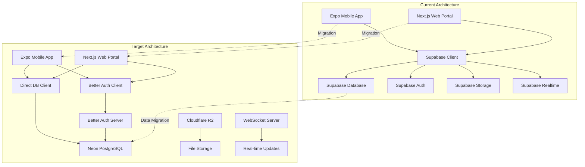
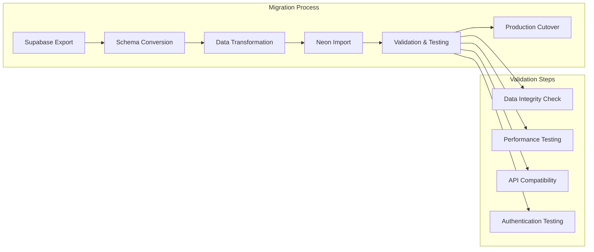

# Supabase to Neon DB + Better Auth Migration Design Document

## Overview

This design document outlines the comprehensive migration strategy from Supabase to Neon DB and Better Auth for the Buzzvar platform. The migration involves both the mobile Expo application and the Next.js web admin portal, ensuring seamless transition while maintaining all existing functionality and improving performance.

The migration will be executed in phases to minimize risk and downtime, with comprehensive testing at each stage. The new architecture will provide better cost efficiency, improved performance, and more flexible authentication flows while maintaining the same user experience.

## Architecture

### High-Level Migration Architecture



### Database Migration Architecture



## Components and Interfaces

### 1. Database Migration Components

#### Neon Database Setup

```typescript
// lib/database/neon-client.ts
import { Pool } from 'pg'
import { drizzle } from 'drizzle-orm/node-postgres'

const pool = new Pool({
  connectionString: process.env.NEON_DATABASE_URL,
  ssl: process.env.NODE_ENV === 'production',
  max: 20,
  idleTimeoutMillis: 30000,
  connectionTimeoutMillis: 2000,
})

export const db = drizzle(pool)

// Connection health check
export async function checkDatabaseHealth() {
  try {
    const client = await pool.connect()
    await client.query('SELECT 1')
    client.release()
    return { status: 'healthy', timestamp: new Date() }
  } catch (error) {
    return { status: 'unhealthy', error: error.message, timestamp: new Date() }
  }
}
```#### 
Schema Migration

```sql
-- migration/001_initial_schema.sql
-- Migrate existing Supabase schema to Neon
CREATE EXTENSION IF NOT EXISTS "uuid-ossp";
CREATE EXTENSION IF NOT EXISTS "postgis";

-- Users table (migrated from Supabase auth.users)
CREATE TABLE users (
    id UUID PRIMARY KEY DEFAULT uuid_generate_v4(),
    email VARCHAR(255) UNIQUE NOT NULL,
    email_verified BOOLEAN DEFAULT FALSE,
    name VARCHAR(255),
    avatar_url TEXT,
    university VARCHAR(255),
    created_at TIMESTAMP WITH TIME ZONE DEFAULT NOW(),
    updated_at TIMESTAMP WITH TIME ZONE DEFAULT NOW()
);

-- Sessions table for Better Auth
CREATE TABLE sessions (
    id VARCHAR(255) PRIMARY KEY,
    user_id UUID NOT NULL REFERENCES users(id) ON DELETE CASCADE,
    expires_at TIMESTAMP WITH TIME ZONE NOT NULL,
    token VARCHAR(255) UNIQUE NOT NULL,
    created_at TIMESTAMP WITH TIME ZONE DEFAULT NOW(),
    updated_at TIMESTAMP WITH TIME ZONE DEFAULT NOW()
);

-- OAuth accounts table for Better Auth
CREATE TABLE accounts (
    id UUID PRIMARY KEY DEFAULT uuid_generate_v4(),
    user_id UUID NOT NULL REFERENCES users(id) ON DELETE CASCADE,
    provider VARCHAR(50) NOT NULL,
    provider_account_id VARCHAR(255) NOT NULL,
    access_token TEXT,
    refresh_token TEXT,
    expires_at TIMESTAMP WITH TIME ZONE,
    created_at TIMESTAMP WITH TIME ZONE DEFAULT NOW(),
    UNIQUE(provider, provider_account_id)
);

-- Migrate existing tables with preserved structure
CREATE TABLE venues (
    id UUID PRIMARY KEY DEFAULT uuid_generate_v4(),
    name VARCHAR(255) NOT NULL,
    description TEXT,
    address TEXT,
    latitude DECIMAL(10, 8),
    longitude DECIMAL(11, 8),
    hours JSONB,
    contact JSONB,
    cover_image_url TEXT,
    cover_video_url TEXT,
    created_at TIMESTAMP WITH TIME ZONE DEFAULT NOW(),
    updated_at TIMESTAMP WITH TIME ZONE DEFAULT NOW()
);

-- Add indexes for performance
CREATE INDEX idx_users_email ON users(email);
CREATE INDEX idx_sessions_user_id ON sessions(user_id);
CREATE INDEX idx_sessions_token ON sessions(token);
CREATE INDEX idx_accounts_user_id ON accounts(user_id);
CREATE INDEX idx_venues_location ON venues USING GIST(ST_Point(longitude, latitude));
```

### 2. Better Auth Implementation

#### Server Configuration

```typescript
// lib/auth/better-auth-server.ts
import { betterAuth } from "better-auth"
import { expo } from "@better-auth/expo"
import { db } from "../database/neon-client"

export const auth = betterAuth({
  database: {
    provider: "pg",
    url: process.env.NEON_DATABASE_URL!,
  },
  emailAndPassword: {
    enabled: true,
    requireEmailVerification: true,
  },
  socialProviders: {
    google: {
      clientId: process.env.GOOGLE_CLIENT_ID!,
      clientSecret: process.env.GOOGLE_CLIENT_SECRET!,
    },
  },
  plugins: [
    expo({
      scheme: "buzzvar",
    }),
  ],
  session: {
    expiresIn: 60 * 60 * 24 * 7, // 7 days
    updateAge: 60 * 60 * 24, // 1 day
  },
  trustedOrigins: [
    "http://localhost:3000",
    "https://admin.buzzvar.com",
    "buzzvar://",
    "buzzvar://*",
  ],
  rateLimit: {
    window: 60, // 1 minute
    max: 100, // 100 requests per minute
  },
  advanced: {
    generateId: () => crypto.randomUUID(),
  },
})
```

#### Next.js Integration

```typescript
// lib/auth/better-auth-client-web.ts
import { createAuthClient } from "better-auth/react"

export const authClient = createAuthClient({
  baseURL: process.env.NEXT_PUBLIC_AUTH_URL || "http://localhost:3000",
  plugins: [],
})

// Custom hooks for web
export function useAuthRole() {
  const { data: session } = authClient.useSession()
  const [role, setRole] = useState<string | null>(null)

  useEffect(() => {
    if (session?.user) {
      fetch('/api/auth/role')
        .then(res => res.json())
        .then(data => setRole(data.role))
    }
  }, [session])

  return { role, user: session?.user }
}
```

#### Expo Integration

```typescript
// lib/auth/better-auth-client-mobile.ts
import { createAuthClient } from "better-auth/react"
import { expoClient } from "@better-auth/expo/client"
import * as SecureStore from "expo-secure-store"

export const authClient = createAuthClient({
  baseURL: process.env.EXPO_PUBLIC_AUTH_URL!,
  plugins: [
    expoClient({
      scheme: "buzzvar",
      storagePrefix: "buzzvar",
      storage: SecureStore,
    }),
  ],
})

// Custom hook for mobile
export function useAuthenticatedFetch() {
  const getCookies = () => authClient.getCookie()

  const authenticatedFetch = useCallback(async (url: string, options: RequestInit = {}) => {
    const cookies = getCookies()
    
    return fetch(url, {
      ...options,
      headers: {
        ...options.headers,
        'Cookie': cookies || '',
      },
    })
  }, [])

  return authenticatedFetch
}
```###
 3. Database Service Layer

```typescript
// lib/database/services/base-service.ts
import { db } from '../neon-client'
import { eq, and, or, desc, asc } from 'drizzle-orm'

export abstract class BaseService {
  protected db = db

  protected async executeWithRetry<T>(
    operation: () => Promise<T>,
    maxRetries: number = 3
  ): Promise<T> {
    let lastError: Error

    for (let attempt = 1; attempt <= maxRetries; attempt++) {
      try {
        return await operation()
      } catch (error) {
        lastError = error as Error
        
        if (attempt === maxRetries) {
          throw lastError
        }

        // Exponential backoff
        await new Promise(resolve => 
          setTimeout(resolve, Math.pow(2, attempt) * 1000)
        )
      }
    }

    throw lastError!
  }

  protected handleDatabaseError(error: any): never {
    console.error('Database operation failed:', error)
    
    if (error.code === '23505') {
      throw new Error('Duplicate entry')
    } else if (error.code === '23503') {
      throw new Error('Referenced record not found')
    } else if (error.code === '23514') {
      throw new Error('Check constraint violation')
    }
    
    throw new Error('Database operation failed')
  }
}
```

### 4. Real-time Updates Implementation

```typescript
// lib/realtime/websocket-server.ts
import { WebSocketServer } from 'ws'
import { createServer } from 'http'

interface ClientConnection {
  ws: WebSocket
  userId?: string
  subscriptions: Set<string>
}

export class RealtimeServer {
  private wss: WebSocketServer
  private clients: Map<string, ClientConnection> = new Map()

  constructor(port: number = 8080) {
    const server = createServer()
    this.wss = new WebSocketServer({ server })
    
    this.wss.on('connection', this.handleConnection.bind(this))
    server.listen(port, () => {
      console.log(`WebSocket server running on port ${port}`)
    })
  }

  private handleConnection(ws: WebSocket, request: any) {
    const clientId = crypto.randomUUID()
    const client: ClientConnection = {
      ws,
      subscriptions: new Set(),
    }
    
    this.clients.set(clientId, client)

    ws.on('message', (data) => {
      try {
        const message = JSON.parse(data.toString())
        this.handleMessage(clientId, message)
      } catch (error) {
        console.error('Invalid message format:', error)
      }
    })

    ws.on('close', () => {
      this.clients.delete(clientId)
    })
  }

  public broadcastToChannel(channel: string, data: any) {
    const message = JSON.stringify({
      type: 'broadcast',
      channel,
      data,
    })

    this.clients.forEach((client) => {
      if (client.subscriptions.has(channel) && client.ws.readyState === WebSocket.OPEN) {
        client.ws.send(message)
      }
    })
  }
}
```

### 5. File Storage Migration

```typescript
// lib/storage/storage-service.ts
import { S3Client, PutObjectCommand, DeleteObjectCommand } from '@aws-sdk/client-s3'
import { getSignedUrl } from '@aws-sdk/s3-request-presigner'

export class StorageService {
  private r2Client: S3Client
  private bucketName: string
  private accountId: string

  constructor() {
    this.r2Client = new S3Client({
      region: 'auto',
      endpoint: `https://${process.env.CLOUDFLARE_ACCOUNT_ID}.r2.cloudflarestorage.com`,
      credentials: {
        accessKeyId: process.env.CLOUDFLARE_R2_ACCESS_KEY_ID!,
        secretAccessKey: process.env.CLOUDFLARE_R2_SECRET_ACCESS_KEY!,
      },
    })
    this.bucketName = process.env.CLOUDFLARE_R2_BUCKET!
    this.accountId = process.env.CLOUDFLARE_ACCOUNT_ID!
  }

  async uploadFile(file: Buffer, key: string, contentType: string): Promise<string> {
    const command = new PutObjectCommand({
      Bucket: this.bucketName,
      Key: key,
      Body: file,
      ContentType: contentType,
    })

    await this.r2Client.send(command)
    return `https://${this.bucketName}.${this.accountId}.r2.cloudflarestorage.com/${key}`
  }

  async deleteFile(key: string): Promise<void> {
    const command = new DeleteObjectCommand({
      Bucket: this.bucketName,
      Key: key,
    })

    await this.r2Client.send(command)
  }

  async getSignedUploadUrl(key: string, contentType: string): Promise<string> {
    const command = new PutObjectCommand({
      Bucket: this.bucketName,
      Key: key,
      ContentType: contentType,
    })

    return await getSignedUrl(this.r2Client, command, { expiresIn: 3600 })
  }
}
```

## Data Models

### Database Schema with Drizzle ORM

```typescript
// lib/database/schema.ts
import { pgTable, uuid, varchar, text, timestamp, boolean, decimal, jsonb } from 'drizzle-orm/pg-core'

export const usersTable = pgTable('users', {
  id: uuid('id').primaryKey().defaultRandom(),
  email: varchar('email', { length: 255 }).unique().notNull(),
  emailVerified: boolean('email_verified').default(false),
  name: varchar('name', { length: 255 }),
  avatarUrl: text('avatar_url'),
  university: varchar('university', { length: 255 }),
  createdAt: timestamp('created_at').defaultNow(),
  updatedAt: timestamp('updated_at').defaultNow(),
})

export const sessionsTable = pgTable('sessions', {
  id: varchar('id', { length: 255 }).primaryKey(),
  userId: uuid('user_id').references(() => usersTable.id, { onDelete: 'cascade' }).notNull(),
  expiresAt: timestamp('expires_at').notNull(),
  token: varchar('token', { length: 255 }).unique().notNull(),
  createdAt: timestamp('created_at').defaultNow(),
  updatedAt: timestamp('updated_at').defaultNow(),
})

export const venuesTable = pgTable('venues', {
  id: uuid('id').primaryKey().defaultRandom(),
  name: varchar('name', { length: 255 }).notNull(),
  description: text('description'),
  address: text('address'),
  latitude: decimal('latitude', { precision: 10, scale: 8 }),
  longitude: decimal('longitude', { precision: 11, scale: 8 }),
  hours: jsonb('hours'),
  contact: jsonb('contact'),
  coverImageUrl: text('cover_image_url'),
  coverVideoUrl: text('cover_video_url'),
  createdAt: timestamp('created_at').defaultNow(),
  updatedAt: timestamp('updated_at').defaultNow(),
})
```

## Testing Strategy

### Migration Testing Framework

```typescript
// tests/migration/migration-test-suite.ts
import { describe, test, expect, beforeAll } from 'vitest'
import { DataMigrator } from '../../scripts/migrate-data'
import { db } from '../../lib/database/neon-client'

describe('Data Migration Tests', () => {
  let migrator: DataMigrator

  beforeAll(async () => {
    migrator = new DataMigrator({
      batchSize: 100,
      delayBetweenBatches: 100,
      validateData: true,
    })
  })

  test('should migrate all users successfully', async () => {
    await migrator.migrateUsers()
    
    const userCount = await db.select({ count: count() }).from(usersTable)
    expect(userCount[0].count).toBeGreaterThan(0)
  })

  test('should preserve data integrity during migration', async () => {
    await migrator.validateMigration()
    // Test passes if no exception is thrown
  })
})
```

## Security Considerations

### Authentication Security

1. **Session Management**
   - Secure session tokens with proper expiration
   - HTTP-only cookies for web applications
   - Secure storage in Expo SecureStore for mobile

2. **OAuth Security**
   - Proper PKCE implementation for mobile OAuth
   - State parameter validation
   - Secure redirect URI handling

3. **Database Security**
   - Connection string encryption
   - Prepared statements to prevent SQL injection
   - Role-based access control at database level

## Performance Optimization

### Database Performance

1. **Connection Pooling**
   - Optimized connection pool configuration
   - Connection health monitoring
   - Automatic failover handling

2. **Query Optimization**
   - Proper indexing strategy
   - Query performance monitoring
   - Batch operations for bulk updates

## Deployment Strategy

### Migration Phases

1. **Phase 1: Infrastructure Setup**
   - Set up Neon DB instance
   - Configure Better Auth server
   - Set up file storage (Cloudflare R2)
   - Deploy WebSocket server

2. **Phase 2: Data Migration**
   - Export data from Supabase
   - Transform and import to Neon DB
   - Validate data integrity
   - Set up real-time sync during transition

3. **Phase 3: Application Updates**
   - Update mobile app with Better Auth
   - Update web portal with new authentication
   - Deploy updated applications to staging
   - Comprehensive testing

4. **Phase 4: Production Cutover**
   - Schedule maintenance window
   - Final data sync
   - Switch DNS/load balancer
   - Monitor system health

### Rollback Strategy

```typescript
// scripts/rollback-plan.ts
export class RollbackManager {
  async executeRollback() {
    console.log('Starting rollback procedure...')
    
    // 1. Switch traffic back to Supabase
    await this.switchTrafficToSupabase()
    
    // 2. Sync any new data back to Supabase
    await this.syncDataToSupabase()
    
    // 3. Verify Supabase functionality
    await this.verifySupabaseHealth()
    
    console.log('Rollback completed successfully')
  }
}
```

This comprehensive design provides a robust migration strategy from Supabase to Neon DB and Better Auth while maintaining all existing functionality and improving performance.