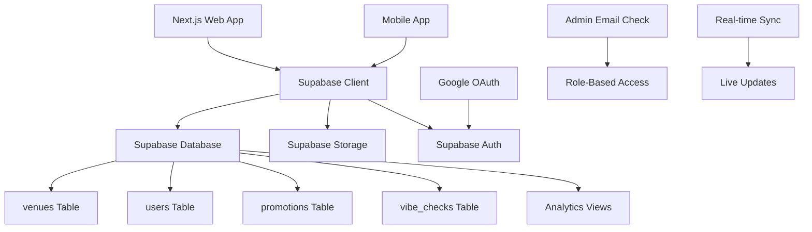

# Web Admin Portal Design Document

## Overview

The Web Admin Portal is a Next.js 14 web application that provides venue owners and platform administrators with comprehensive management capabilities for the Buzzvar platform. Built with TypeScript, Tailwind CSS, and shadcn/ui components, it maintains design consistency with the mobile app while providing powerful desktop-optimized management tools.

The portal integrates directly with the existing Supabase database, ensuring real-time synchronization with the mobile app. It features role-based access control, comprehensive analytics dashboards, and intuitive content management interfaces.

## Architecture

### High-Level Architecture



### Application Structure

```
web-admin-portal/
├── src/
│   ├── app/
│   │   ├── (auth)/
│   │   │   ├── login/
│   │   │   └── register/
│   │   ├── (dashboard)/
│   │   │   ├── venue/
│   │   │   ├── promotions/
│   │   │   ├── analytics/
│   │   │   └── admin/
│   │   ├── api/
│   │   │   ├── auth/
│   │   │   ├── venues/
│   │   │   ├── promotions/
│   │   │   └── analytics/
│   │   ├── globals.css
│   │   ├── layout.tsx
│   │   └── page.tsx
│   ├── components/
│   │   ├── ui/ (shadcn/ui components)
│   │   ├── auth/
│   │   ├── dashboard/
│   │   ├── venue/
│   │   ├── promotions/
│   │   ├── analytics/
│   │   └── admin/
│   ├── lib/
│   │   ├── supabase.ts
│   │   ├── auth.ts
│   │   ├── utils.ts
│   │   └── types.ts
│   ├── hooks/
│   │   ├── useAuth.ts
│   │   ├── useVenue.ts
│   │   └── useAnalytics.ts
│   └── services/
│       ├── venueService.ts
│       ├── promotionService.ts
│       ├── analyticsService.ts
│       └── adminService.ts
```

## Components and Interfaces

### Database Schema Extensions

#### New Table: venue_owners

```sql
CREATE TABLE public.venue_owners (
    id UUID DEFAULT uuid_generate_v4() PRIMARY KEY,
    user_id UUID REFERENCES public.users(id) ON DELETE CASCADE NOT NULL,
    venue_id UUID REFERENCES public.venues(id) ON DELETE CASCADE NOT NULL,
    role TEXT NOT NULL DEFAULT 'owner' CHECK (role IN ('owner', 'manager', 'staff')),
    created_at TIMESTAMP WITH TIME ZONE DEFAULT NOW() NOT NULL,
    
    CONSTRAINT unique_user_venue UNIQUE (user_id, venue_id)
);

-- RLS Policies
ALTER TABLE public.venue_owners ENABLE ROW LEVEL SECURITY;

CREATE POLICY "Venue owners can view their associations" ON public.venue_owners FOR SELECT 
USING (auth.uid() = user_id);

CREATE POLICY "Venue owners can manage their staff" ON public.venue_owners FOR ALL 
USING (
    EXISTS (
        SELECT 1 FROM public.venue_owners vo 
        WHERE vo.venue_id = venue_owners.venue_id 
        AND vo.user_id = auth.uid() 
        AND vo.role = 'owner'
    )
);
```

#### Analytics Views

```sql
-- Venue analytics view
CREATE VIEW public.venue_analytics AS
SELECT 
    v.id as venue_id,
    v.name as venue_name,
    COUNT(DISTINCT cv.user_id) as total_views,
    COUNT(DISTINCT ub.user_id) as total_bookmarks,
    COUNT(DISTINCT vc.id) as total_vibe_checks,
    AVG(vc.busyness_rating) as avg_busyness_rating,
    COUNT(DISTINCT CASE WHEN vc.created_at > NOW() - INTERVAL '7 days' THEN vc.id END) as recent_vibe_checks,
    COUNT(DISTINCT CASE WHEN cv.created_at > NOW() - INTERVAL '7 days' THEN cv.user_id END) as recent_views
FROM public.venues v
LEFT JOIN public.club_views cv ON v.id = cv.club_id
LEFT JOIN public.user_bookmarks ub ON v.id = ub.venue_id
LEFT JOIN public.vibe_checks vc ON v.id = vc.venue_id
GROUP BY v.id, v.name;

-- Platform analytics view
CREATE VIEW public.platform_analytics AS
SELECT 
    COUNT(DISTINCT u.id) as total_users,
    COUNT(DISTINCT v.id) as total_venues,
    COUNT(DISTINCT vc.id) as total_vibe_checks,
    COUNT(DISTINCT p.id) as total_promotions,
    COUNT(DISTINCT CASE WHEN u.created_at > NOW() - INTERVAL '7 days' THEN u.id END) as new_users_week,
    COUNT(DISTINCT CASE WHEN v.created_at > NOW() - INTERVAL '7 days' THEN v.id END) as new_venues_week,
    COUNT(DISTINCT CASE WHEN vc.created_at > NOW() - INTERVAL '7 days' THEN vc.id END) as new_vibe_checks_week
FROM public.users u
CROSS JOIN public.venues v
CROSS JOIN public.vibe_checks vc
CROSS JOIN public.promotions p;
```

### TypeScript Interfaces

```typescript
// User roles and permissions
export interface UserRole {
  id: string;
  email: string;
  role: 'venue_owner' | 'admin' | 'user';
  venues?: VenueOwnership[];
}

export interface VenueOwnership {
  id: string;
  venue_id: string;
  role: 'owner' | 'manager' | 'staff';
  venue: Venue;
}

// Venue management interfaces
export interface VenueFormData {
  name: string;
  description?: string;
  address?: string;
  latitude?: number;
  longitude?: number;
  hours?: string;
  contact?: string;
  cover_image?: File;
  cover_video?: File;
}

export interface VenueAnalytics {
  venue_id: string;
  venue_name: string;
  total_views: number;
  total_bookmarks: number;
  total_vibe_checks: number;
  avg_busyness_rating: number;
  recent_vibe_checks: number;
  recent_views: number;
  daily_stats: DailyStats[];
  peak_hours: HourlyStats[];
}

// Promotion management interfaces
export interface PromotionFormData {
  title: string;
  description: string;
  start_date: string;
  end_date: string;
  days_of_week: number[];
  start_time?: string;
  end_time?: string;
  promotion_type: 'discount' | 'event' | 'special' | 'happy_hour';
  image?: File;
}

// Admin interfaces
export interface PlatformAnalytics {
  total_users: number;
  total_venues: number;
  total_vibe_checks: number;
  total_promotions: number;
  new_users_week: number;
  new_venues_week: number;
  new_vibe_checks_week: number;
  user_growth: GrowthData[];
  venue_growth: GrowthData[];
  engagement_metrics: EngagementData[];
}

export interface UserManagement {
  id: string;
  name: string;
  email: string;
  university?: string;
  created_at: string;
  last_active?: string;
  total_vibe_checks: number;
  total_bookmarks: number;
  status: 'active' | 'suspended' | 'deleted';
}
```

### Authentication System

#### Auth Configuration

```typescript
// lib/auth.ts
import { createServerClient } from '@supabase/ssr'
import { NextRequest, NextResponse } from 'next/server'

export async function createClient(request: NextRequest) {
  let response = NextResponse.next({
    request: {
      headers: request.headers,
    },
  })

  const supabase = createServerClient(
    process.env.NEXT_PUBLIC_SUPABASE_URL!,
    process.env.NEXT_PUBLIC_SUPABASE_ANON_KEY!,
    {
      cookies: {
        get(name: string) {
          return request.cookies.get(name)?.value
        },
        set(name: string, value: string, options: any) {
          request.cookies.set({
            name,
            value,
            ...options,
          })
          response = NextResponse.next({
            request: {
              headers: request.headers,
            },
          })
          response.cookies.set({
            name,
            value,
            ...options,
          })
        },
        remove(name: string, options: any) {
          request.cookies.set({
            name,
            value: '',
            ...options,
          })
          response = NextResponse.next({
            request: {
              headers: request.headers,
            },
          })
          response.cookies.set({
            name,
            value: '',
            ...options,
          })
        },
      },
    }
  )

  return { supabase, response }
}

export async function getUserRole(email: string): Promise<UserRole> {
  const adminEmails = process.env.ADMIN_EMAILS?.split(',') || []
  
  if (adminEmails.includes(email)) {
    return { id: '', email, role: 'admin' }
  }

  // Check if user owns any venues
  const { supabase } = await createClient()
  const { data: venueOwnership } = await supabase
    .from('venue_owners')
    .select(`
      id,
      venue_id,
      role,
      venue:venues(*)
    `)
    .eq('user_id', userId)

  if (venueOwnership && venueOwnership.length > 0) {
    return {
      id: userId,
      email,
      role: 'venue_owner',
      venues: venueOwnership
    }
  }

  return { id: userId, email, role: 'user' }
}
```

#### Middleware for Route Protection

```typescript
// middleware.ts
import { createMiddlewareClient } from '@supabase/auth-helpers-nextjs'
import { NextResponse } from 'next/server'
import type { NextRequest } from 'next/server'

export async function middleware(req: NextRequest) {
  const res = NextResponse.next()
  const supabase = createMiddlewareClient({ req, res })

  const {
    data: { session },
  } = await supabase.auth.getSession()

  // Protect dashboard routes
  if (req.nextUrl.pathname.startsWith('/dashboard')) {
    if (!session) {
      return NextResponse.redirect(new URL('/login', req.url))
    }

    // Check admin routes
    if (req.nextUrl.pathname.startsWith('/dashboard/admin')) {
      const userRole = await getUserRole(session.user.email!)
      if (userRole.role !== 'admin') {
        return NextResponse.redirect(new URL('/dashboard', req.url))
      }
    }
  }

  return res
}

export const config = {
  matcher: ['/dashboard/:path*']
}
```

### React Components

#### 1. Dashboard Layout Component

```typescript
interface DashboardLayoutProps {
  children: React.ReactNode;
  userRole: UserRole;
}

export function DashboardLayout({ children, userRole }: DashboardLayoutProps) {
  return (
    <div className="flex h-screen bg-background">
      <Sidebar userRole={userRole} />
      <main className="flex-1 overflow-y-auto">
        <Header userRole={userRole} />
        <div className="p-6">
          {children}
        </div>
      </main>
    </div>
  )
}
```

#### 2. Venue Management Components

```typescript
interface VenueFormProps {
  venue?: Venue;
  onSubmit: (data: VenueFormData) => Promise<void>;
  isSubmitting: boolean;
}

export function VenueForm({ venue, onSubmit, isSubmitting }: VenueFormProps) {
  // Form implementation with validation
  // Image/video upload handling
  // Location picker integration
}

interface VenueAnalyticsProps {
  venueId: string;
  analytics: VenueAnalytics;
}

export function VenueAnalyticsDashboard({ venueId, analytics }: VenueAnalyticsProps) {
  // Charts and metrics display
  // Time period selection
  // Export functionality
}
```

#### 3. Promotion Management Components

```typescript
interface PromotionListProps {
  venueId: string;
  promotions: Promotion[];
  onEdit: (promotion: Promotion) => void;
  onDelete: (promotionId: string) => void;
}

export function PromotionList({ venueId, promotions, onEdit, onDelete }: PromotionListProps) {
  // Promotion cards with status indicators
  // Quick actions (edit, delete, duplicate)
  // Filtering and sorting
}

interface PromotionFormProps {
  venueId: string;
  promotion?: Promotion;
  onSubmit: (data: PromotionFormData) => Promise<void>;
  onCancel: () => void;
}

export function PromotionForm({ venueId, promotion, onSubmit, onCancel }: PromotionFormProps) {
  // Rich text editor for description
  // Date/time pickers
  // Image upload
  // Preview functionality
}
```

#### 4. Admin Components

```typescript
interface AdminDashboardProps {
  analytics: PlatformAnalytics;
}

export function AdminDashboard({ analytics }: AdminDashboardProps) {
  // Platform overview metrics
  // Growth charts
  // System health indicators
  // Quick actions
}

interface UserManagementProps {
  users: UserManagement[];
  onUserAction: (userId: string, action: 'suspend' | 'delete' | 'activate') => void;
}

export function UserManagementTable({ users, onUserAction }: UserManagementProps) {
  // Searchable/filterable user table
  // User details modal
  // Bulk actions
  // Activity history
}

interface VenueManagementProps {
  venues: Venue[];
  onVenueAction: (venueId: string, action: 'edit' | 'delete' | 'approve') => void;
}

export function VenueManagementTable({ venues, onVenueAction }: VenueManagementProps) {
  // Venue overview table
  // Status management
  // Content moderation tools
  // Analytics preview
}
```

## Data Models

### Service Layer Architecture

```typescript
// services/venueService.ts
export class VenueService {
  static async getVenuesByOwner(userId: string): Promise<Venue[]> {
    // Fetch venues owned by user
  }

  static async updateVenue(venueId: string, data: VenueFormData): Promise<Venue> {
    // Update venue with media upload handling
  }

  static async getVenueAnalytics(venueId: string, period: string): Promise<VenueAnalytics> {
    // Fetch comprehensive venue analytics
  }

  static async uploadVenueMedia(venueId: string, file: File, type: 'image' | 'video'): Promise<string> {
    // Handle media upload to Supabase Storage
  }
}

// services/promotionService.ts
export class PromotionService {
  static async getVenuePromotions(venueId: string): Promise<Promotion[]> {
    // Fetch all promotions for venue
  }

  static async createPromotion(venueId: string, data: PromotionFormData): Promise<Promotion> {
    // Create new promotion with validation
  }

  static async updatePromotion(promotionId: string, data: PromotionFormData): Promise<Promotion> {
    // Update existing promotion
  }

  static async deletePromotion(promotionId: string): Promise<void> {
    // Soft delete promotion
  }
}

// services/adminService.ts
export class AdminService {
  static async getPlatformAnalytics(): Promise<PlatformAnalytics> {
    // Fetch platform-wide analytics
  }

  static async getAllUsers(filters?: UserFilters): Promise<UserManagement[]> {
    // Fetch all users with filtering
  }

  static async getAllVenues(filters?: VenueFilters): Promise<Venue[]> {
    // Fetch all venues with filtering
  }

  static async moderateUser(userId: string, action: string): Promise<void> {
    // Handle user moderation actions
  }

  static async moderateVenue(venueId: string, action: string): Promise<void> {
    // Handle venue moderation actions
  }
}
```

### Real-time Updates

```typescript
// hooks/useRealtimeUpdates.ts
export function useRealtimeVenueUpdates(venueId: string) {
  const [venue, setVenue] = useState<Venue | null>(null)
  const [analytics, setAnalytics] = useState<VenueAnalytics | null>(null)

  useEffect(() => {
    const supabase = createClientComponentClient()

    // Subscribe to venue changes
    const venueSubscription = supabase
      .channel(`venue-${venueId}`)
      .on('postgres_changes', {
        event: '*',
        schema: 'public',
        table: 'venues',
        filter: `id=eq.${venueId}`
      }, (payload) => {
        setVenue(payload.new as Venue)
      })
      .subscribe()

    // Subscribe to vibe check changes for analytics
    const vibeCheckSubscription = supabase
      .channel(`vibe-checks-${venueId}`)
      .on('postgres_changes', {
        event: 'INSERT',
        schema: 'public',
        table: 'vibe_checks',
        filter: `venue_id=eq.${venueId}`
      }, () => {
        // Refresh analytics
        refreshAnalytics()
      })
      .subscribe()

    return () => {
      venueSubscription.unsubscribe()
      vibeCheckSubscription.unsubscribe()
    }
  }, [venueId])

  return { venue, analytics }
}
```

## Error Handling

### Global Error Boundary

```typescript
// components/ErrorBoundary.tsx
export function ErrorBoundary({ children }: { children: React.ReactNode }) {
  return (
    <ErrorBoundaryComponent
      fallback={({ error, resetError }) => (
        <div className="flex flex-col items-center justify-center min-h-screen p-4">
          <h2 className="text-2xl font-bold mb-4">Something went wrong</h2>
          <p className="text-muted-foreground mb-4">{error.message}</p>
          <Button onClick={resetError}>Try again</Button>
        </div>
      )}
    >
      {children}
    </ErrorBoundaryComponent>
  )
}
```

### API Error Handling

```typescript
// lib/apiClient.ts
export class ApiError extends Error {
  constructor(
    message: string,
    public status: number,
    public code?: string
  ) {
    super(message)
    this.name = 'ApiError'
  }
}

export async function handleApiResponse<T>(response: Response): Promise<T> {
  if (!response.ok) {
    const error = await response.json().catch(() => ({}))
    throw new ApiError(
      error.message || 'An error occurred',
      response.status,
      error.code
    )
  }

  return response.json()
}
```

### Form Validation

```typescript
// lib/validation.ts
import { z } from 'zod'

export const venueFormSchema = z.object({
  name: z.string().min(1, 'Venue name is required').max(100),
  description: z.string().max(500).optional(),
  address: z.string().max(200).optional(),
  latitude: z.number().min(-90).max(90).optional(),
  longitude: z.number().min(-180).max(180).optional(),
  hours: z.string().max(200).optional(),
  contact: z.string().max(100).optional(),
})

export const promotionFormSchema = z.object({
  title: z.string().min(1, 'Title is required').max(100),
  description: z.string().min(1, 'Description is required').max(500),
  start_date: z.string().min(1, 'Start date is required'),
  end_date: z.string().min(1, 'End date is required'),
  days_of_week: z.array(z.number().min(0).max(6)),
  start_time: z.string().optional(),
  end_time: z.string().optional(),
  promotion_type: z.enum(['discount', 'event', 'special', 'happy_hour']),
}).refine((data) => new Date(data.end_date) > new Date(data.start_date), {
  message: "End date must be after start date",
  path: ["end_date"],
})
```

## Testing Strategy

### Unit Tests

```typescript
// __tests__/services/venueService.test.ts
describe('VenueService', () => {
  test('should fetch venues by owner', async () => {
    // Mock Supabase client
    // Test venue fetching logic
  })

  test('should update venue with media upload', async () => {
    // Test venue update with file handling
  })

  test('should handle venue analytics calculation', async () => {
    // Test analytics aggregation
  })
})
```

### Integration Tests

```typescript
// __tests__/api/venues.test.ts
describe('/api/venues', () => {
  test('should create venue for authenticated owner', async () => {
    // Test API endpoint with authentication
  })

  test('should reject unauthorized venue creation', async () => {
    // Test security policies
  })
})
```

### E2E Tests

```typescript
// e2e/venue-management.spec.ts
test('venue owner can manage their venue', async ({ page }) => {
  // Login as venue owner
  // Navigate to venue dashboard
  // Update venue information
  // Verify changes are saved
  // Check mobile app reflects changes
})
```

## Security Considerations

### Authentication & Authorization

1. **OAuth Integration**
   - Secure Google OAuth implementation
   - Session management with Supabase Auth
   - Role-based access control

2. **Route Protection**
   - Middleware-based authentication
   - Role-based route restrictions
   - API endpoint security

3. **Data Access Control**
   - RLS policies for all database operations
   - Owner-based venue access
   - Admin privilege verification

### Input Validation & Sanitization

1. **Form Validation**
   - Client-side validation with Zod
   - Server-side validation for all inputs
   - File upload security (type, size limits)

2. **SQL Injection Prevention**
   - Parameterized queries through Supabase
   - Input sanitization for all user data
   - Proper error handling without data exposure

### File Upload Security

1. **Media Upload**
   - File type validation
   - Size limits enforcement
   - Virus scanning integration
   - Secure storage with Supabase Storage

## Performance Optimization

### Database Optimization

1. **Query Optimization**
   - Efficient joins for analytics queries
   - Proper indexing for search operations
   - Pagination for large datasets

2. **Caching Strategy**
   - Redis caching for analytics data
   - Browser caching for static assets
   - CDN integration for media files

### Frontend Optimization

1. **Code Splitting**
   - Route-based code splitting
   - Component lazy loading
   - Dynamic imports for heavy components

2. **Image Optimization**
   - Next.js Image component usage
   - Automatic format optimization
   - Responsive image serving

### Real-time Performance

1. **Subscription Management**
   - Efficient WebSocket connections
   - Selective data subscriptions
   - Connection pooling and cleanup

## Deployment Architecture

### Production Setup

```yaml
# docker-compose.yml
version: '3.8'
services:
  web-admin:
    build: .
    ports:
      - "3000:3000"
    environment:
      - NEXT_PUBLIC_SUPABASE_URL=${SUPABASE_URL}
      - NEXT_PUBLIC_SUPABASE_ANON_KEY=${SUPABASE_ANON_KEY}
      - ADMIN_EMAILS=${ADMIN_EMAILS}
    depends_on:
      - redis
  
  redis:
    image: redis:alpine
    ports:
      - "6379:6379"
```

### Environment Configuration

```bash
# .env.production
NEXT_PUBLIC_SUPABASE_URL=https://your-project.supabase.co
NEXT_PUBLIC_SUPABASE_ANON_KEY=your-anon-key
SUPABASE_SERVICE_ROLE_KEY=your-service-role-key
ADMIN_EMAILS=admin1@example.com,admin2@example.com
NEXTAUTH_URL=https://admin.buzzvar.com
NEXTAUTH_SECRET=your-nextauth-secret
REDIS_URL=redis://redis:6379
```